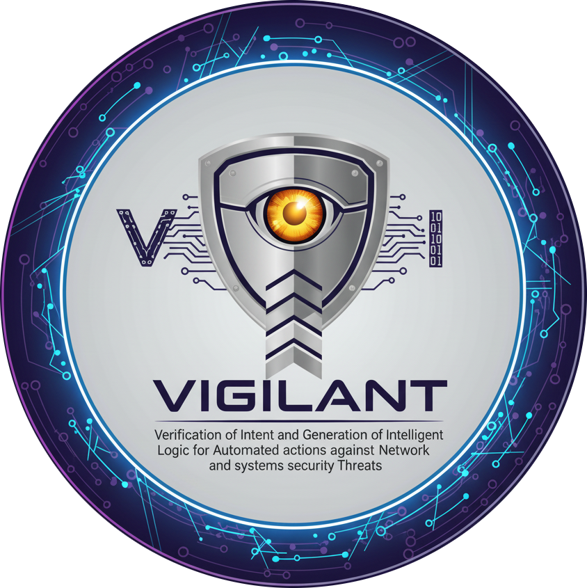
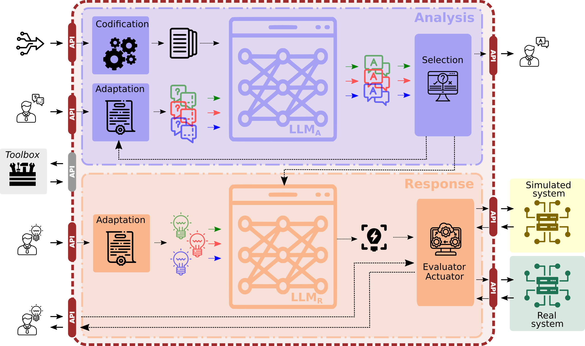

# VIGILANT

**Verification of Intent and Generation of Intelligent Logic for Automated actions against Network and systems security Threats**

VIGILANT is a research-driven, open framework to **analyze, diagnose, and respond to security incidents using Large Language Models (LLMs)**. It focuses on **natural-language interaction**, **encoding heterogeneous security data (logs, NIDS alerts, network traces/PCAP)**, **intent-to-configuration translation**, and **safe validation of proposed actions in simulation** before touching production.

<p align="center">
  <a href="https://nesg.ugr.es/projects/vigilant" target="_blank">
    
  </a>
</p>

<p align="center">
<a href="https://nesg.ugr.es" target="_blank"></a>


</p>

---

## ⚙️ Key capabilities

- **Data ingestion & encoding** of heterogeneous security sources (logs, IDS alerts, network traces/PCAP) into LLM-interpretable tokens/text.  
- **Natural-language queries** to accelerate incident inspection/diagnosis.  
- **Intent-based actions**: translate analyst intentions (in plain English/Spanish) into concrete security configurations (e.g., firewall policies).  
- **Action verification**: automatically validate proposed configurations in a **simulated environment** (a “digital twin” subset) before optional deployment.  
- **Fine-tuning/RAG options** to specialize models for cybersecurity tasks and external tool enrichment (e.g., CTI, visualization).

---

## 🏗️ Architecture (high-level)

<p align="center">
  <a href="docs/architecture.png" target="_blank">
    
  </a>
  <br/>
  <em>Figure: VIGILANT high-level architecture. Click to view full size. (You can replace with docs/architecture.svg if preferred.)</em>
</p>

1. **System inputs**: analyst prompts + security data (logs, alerts, PCAP).  
2. **Data encoding**: transform raw sources into representative tokens/text for the LLM (unimodal) and explore **multimodal** paths for raw formats when feasible.  
3. **Request adaptation**: decompose complex prompts into sub-queries and iterate.  
4. **Response aggregation**: synthesize sub-answers into a coherent diagnosis.  
5. **Intention → configuration**: map analyst intentions to actionable configs (e.g., iptables rules).  
6. **Simulation & validation**: test configurations in a controlled environment before real deployment.  
7. **External tool integration**: CTI lookups, plots, dashboards, etc.

> **Note:** Place the image at `docs/architecture.png` (recommended: 1600×1000, PNG or SVG). Keep any sensitive details out of the diagram.

---

## 📁 Repository layout

```
vigilant/
├─ docs/                      # Architecture notes, design decisions, API docs
│  └─ architecture.png        # <-- Add/replace your architecture figure here
├─ datasets/                  # Sample/redacted test data & schemas (no sensitive data)
├─ encoding/                  # D2.1: event encoding + prompt-engineering utilities
│  ├─ log_parsers/
│  ├─ nettrace/               # PCAP → features/tokens pipelines
│  └─ notebooks/
├─ models/
│  ├─ analysis_llm/           # D3.1 artifacts (adapters, RAG pipelines, eval scripts)
│  ├─ response_llm/           # D3.3 intent→config generation & evaluation
│  └─ evaluators/             # Benchmarks/metrics for analysis & response LLMs
├─ sim/                       # D3.2: simulation harness (“digital twin” subset)
│  ├─ envs/                   # docker-compose based lab topologies
│  └─ validators/             # safety checks for proposed configs
├─ backend/                   # Core services (API, orchestration, tool adapters)
├─ frontend/                  # Minimal analyst UI (D3.4)
├─ tools/                     # CTI connectors, visualization helpers
├─ scripts/                   # Dev/CI utilities, data prep, lint, format, etc.
├─ examples/                  # End-to-end example flows & sample prompts
├─ CONTRIBUTING.md
├─ CODE_OF_CONDUCT.md
└─ LICENSE
```

---

## 🚀 Quick start

### Prerequisites

- Linux or macOS (x86_64).  
- **Python 3.11+** and **Poetry** or **uv** for dependency management.  
- (Optional) **CUDA 12.x** + recent NVIDIA drivers for local GPU acceleration.  
- Docker & docker-compose (for the simulation environments).

```bash
# clone
git clone https://github.com/nesg-ugr/vigilant
cd vigilant

# create env & install
python -m venv .venv && source .venv/bin/activate
pip install -U pip
pip install -r requirements.txt  # or: poetry install / uv sync

# sanity checks
python -m pip list
pytest -q || true                 # run tests if present

# spin up a minimal stack (API + UI)
docker compose -f sim/envs/minimal/docker-compose.yml up --build
```

---

## 💻 Usage

### 1) Encode a dataset and query the analysis LLM

```bash
python encoding/nettrace/pcap_to_tokens.py \
  --pcap ./datasets/demo/exfiltration_sample.pcap \
  --out ./datasets/demo/exfiltration_tokens.jsonl
```

### 2) Express an intent and generate a config proposal

```bash
python models/response_llm/intent_to_config.py \
  --intent "Isolate devices 10.10.1.21 and 10.10.1.37 suspected of data exfiltration" \
  --context ./datasets/demo/exfiltration_context.yaml \
  --out ./sim/candidates/iso_rules.json
```

### 3) Validate in simulation

```bash
python sim/validators/run_validation.py \
  --candidate ./sim/candidates/iso_rules.json \
  --env sim/envs/minimal
```

---

## 🤝 Contributing

We welcome issues, discussions, and PRs!

1. Open an issue describing your proposal/bug with minimal repro.  
2. Follow the style checks: `ruff`, `black`, and `mypy` where applicable.  
3. Add/extend tests for new functionality.  
4. Ensure no sensitive data is committed; use synthetic/redacted samples only.

---

## 📚 Publications

The following list gathers **scientific publications derived from or related to the VIGILANT project**.  
Please cite the relevant paper(s) when using any portion of this repository.  
A full and updated list is maintained in [`publications.bib`](./publications.bib).

```bibtex
@misc{vigilant_proposal_2025,
  title   = {VIGILANT: Verification of Intent and Generation of Intelligent Logic for Automated actions against Network and systems security Threats},
  author  = {García Teodoro, Pedro and Magán Carrión, Roberto and NESG-UGR Team},
  howpublished = {\url{https://github.com/nesg-ugr/vigilant}},
  year    = {2025},
  note    = {Research project and prototype implementation}
}

@article{magan2025_vigilant_framework,
  title   = {Leveraging Large Language Models for Automated Incident Response: The VIGILANT Framework},
  author  = {Magán Carrión, Roberto and García Teodoro, Pedro and Camacho, José and Maciá-Fernández, Gabriel},
  journal = {Computers & Security},
  year    = {2025},
  note    = {Under submission}
}

@inproceedings{magan2025_jnic_vigilant_demo,
  title   = {VIGILANT: An LLM-driven Framework for Automated and Verifiable Cybersecurity Actions},
  author  = {Magán Carrión, Roberto and García Teodoro, Pedro},
  booktitle = {JNIC 2025 – Jornadas Nacionales de Investigación en Ciberseguridad},
  year    = {2025},
  note    = {Demo track}
}
```

---

## 💡 Funding & acknowledgments

This work is part of the **VIGILANT** research project (Knowledge Generation Projects 2024 – Oriented Research Type B, Spanish Ministry of Science, Innovation and Universities).  
We acknowledge the **NESG (TIC-233)** group and collaborating partners, and plan public releases of preprocessing, benchmarks, models, and front/back-end artifacts to foster reproducible research and SME adoption.

---

## 🧾 License

Released under the **Apache License 2.0**.  
See the `LICENSE` file for details.

---

**Maintainers**

- **NESG – Network Engineering & Security Group (UGR)**  
  PIs: **Pedro García Teodoro** & **Roberto Magán Carrión**  
  Website: [https://nesg.ugr.es](https://nesg.ugr.es)
